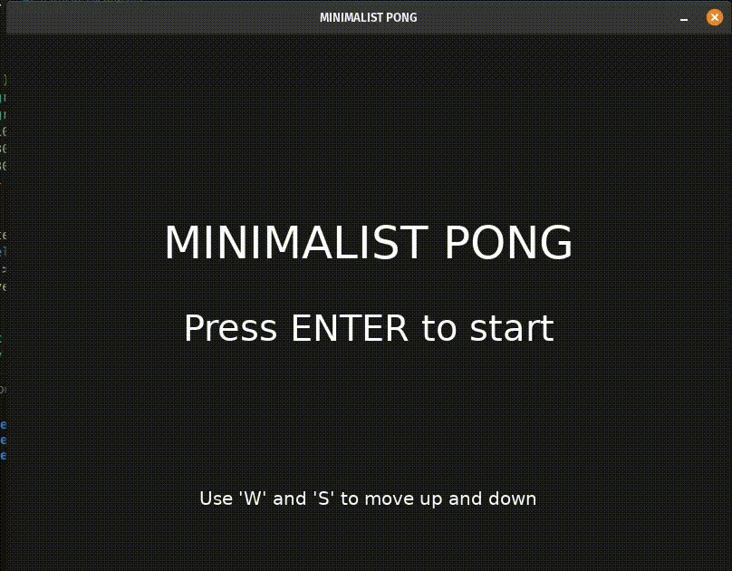

# MINIMALIST PONG

[](https://love2d.org)

A classic clone of the Pong game with a modern, minimalist touch, developed from scratch to learn the LÖVE 2D framework.



---

## 📜 About The Project

This project was created as a step-by-step learning exercise to explore the fundamental concepts of the LÖVE 2D framework.

The result is a functional and fun game that covers everything from basic game logic to visual effects and clean code organization.

---

## 🛠️ Tech Stack

* **Framework:** [LÖVE 2D](https://love2d.org) (version 11.3)
* **Language:** Lua

---

## 🚀 Getting Started

To run this project, you will need to have LÖVE installed on your system.

1.  **Install LÖVE:** Download the appropriate version for your OS at [love2d.org](https://love2d.org).

2.  **Clone the repository:**
    ```sh
    git clone https://github.com/AlissonGRN/minimalist-pong.git
    ```

3.  **Run the game:** Navigate to the project folder in your terminal and run the command:
    ```sh
    love .
    ```
    Alternatively, you can just drag and drop the project folder onto the LÖVE executable.

---

# 📄 License

This project is distributed under the MIT License.

<details>
<summary>Click to view the full license text</summary>

```text
MIT License

Copyright (c) 2025 Alisson Nascimento

Permission is hereby granted, free of charge, to any person obtaining a copy
of this software and associated documentation files (the "Software"), to deal
in the Software without restriction, including without limitation the rights
to use, copy, modify, merge, publish, distribute, sublicense, and/or sell
copies of the Software, and to permit persons to whom the Software is
furnished to do so, subject to the following conditions:

The above copyright notice and this permission notice shall be included in all
copies or substantial portions of the Software.

THE SOFTWARE IS PROVIDED "AS IS", WITHOUT WARRANTY OF ANY KIND, EXPRESS OR
IMPLIED, INCLUDING BUT NOT LIMITED TO THE WARRANTIES OF MERCHANTABILITY,
FITNESS FOR A PARTICULAR PURPOSE AND NONINFRINGEMENT. IN NO EVENT SHALL THE
AUTHORS OR COPYRIGHT HOLDERS BE LIABLE FOR ANY CLAIM, DAMAGES OR OTHER
LIABILITY, WHETHER IN AN ACTION OF CONTRACT, TORT OR OTHERWISE, ARISING FROM,
OUT OF OR IN CONNECTION WITH THE SOFTWARE OR THE USE OR OTHER DEALINGS IN THE
SOFTWARE.


</details>
